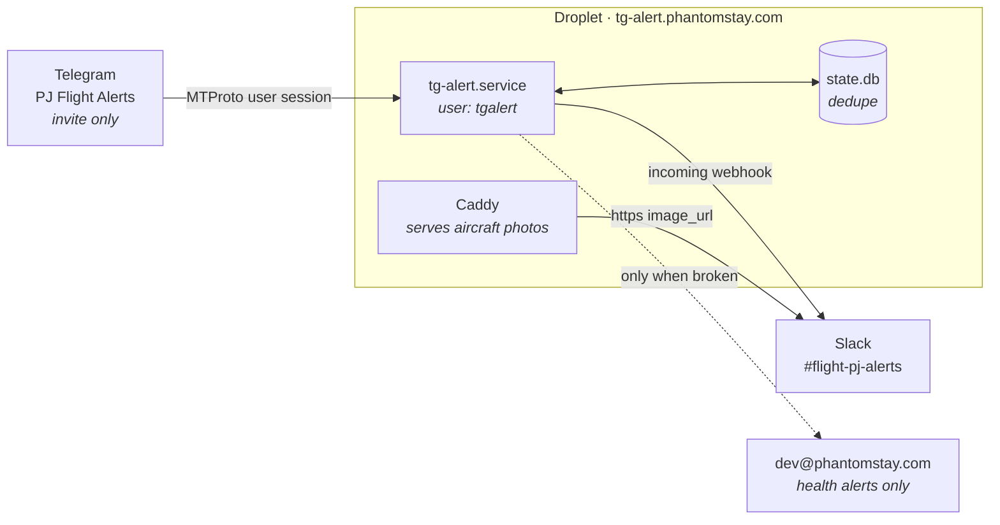
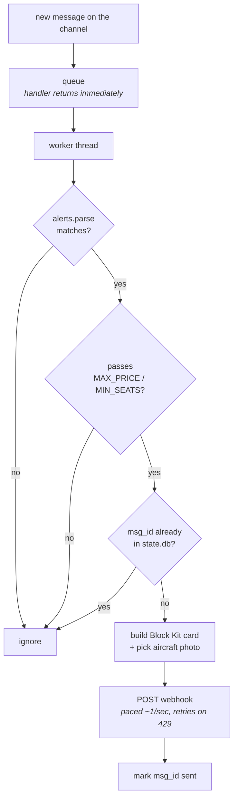
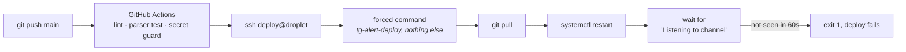

# tg-alert-slack

Mirrors private jet empty leg alerts from an invite-only Telegram channel into
Slack, in near real time, with a photo of the aircraft attached.

Runs as a systemd service on a DigitalOcean droplet. Deploys itself from `main`.
Emails you when it breaks.



> **Full documentation** including server layout, external service configuration and
> the security model: [`docs/phantom-pj-alerts-documentation.pdf`](docs/phantom-pj-alerts-documentation.pdf)

## Why a user session and not a bot

A Telegram *bot* cannot read a channel unless the channel owner adds it as an
admin. This channel is invite-only, the owner is not our client, and they
declined. The only remaining route is a logged-in **user** session over MTProto,
via Telethon.

That session token can read everything on the account it belongs to. It lives in
`/etc/tg-alert/env`, mode `600`, owned by root, and must never be pasted into
Slack, a ticket, or this repository.

## Quick start, locally

```bash
python3 -m venv .venv
.venv/bin/pip install -r requirements.txt
.venv/bin/python login.py          # prints a session string and channel ids
cp .env.example .env               # fill it in
.venv/bin/python run.py --backfill 20        # dry run, prints only
.venv/bin/python run.py --backfill 20 --send # actually posts
.venv/bin/python run.py                      # live
```

`login.py` asks for the code Telegram sends you. **Never paste that code into a
Telegram chat.** Telegram detects codes shared in chats and invalidates them.

## How a message becomes a Slack card



The handler only enqueues. Posting to Slack is blocking and paced, so doing it
inline would stall Telethon's event loop for the length of a bulk drop and cost
us the connection.

## Files

| Path | Does |
|---|---|
| `run.py` | connects, catches up, filters, de-dupes, posts, health checks |
| `alerts.py` | parses an alert into fields, renders the Slack Block Kit card |
| `login.py` | one-time login, prints session string and channel ids |
| `aircraft_images.json` | aircraft name fragment to photo URL, longest match wins |
| `assets/` | the photos Caddy serves at `tg-alert.phantomstay.com/assets/` |
| `systemd/` | the health check service and its timer |
| `.github/workflows/deploy.yml` | lint, parser test, secret guard, then deploy |
| `DEPLOY.md` | server runbook |

## Commands

Everything runs through the `tg-alert` wrapper on the server, which re-execs
under the service account with the production environment loaded.

```bash
sudo tg-alert --health                     # check every dependency, print a table
sudo tg-alert --test-post                  # one card marked "test, not a real flight"
sudo tg-alert --test-notify                # prove the ops email path works
sudo tg-alert --backfill 20 --send --force # repost the last 20, ignoring dedupe
sudo tg-alert --mark-seen 40               # mark existing posts seen, post nothing
```

`--force` exists because `--mark-seen` puts message ids in the dedupe DB. Without
it a backfill prints "already sent, skipping" and posts nothing.

## Configuration

All of it lives in `/etc/tg-alert/env` on the server, `.env` locally. See
`.env.example`.

| Key | Default | Does |
|---|---|---|
| `TG_API_ID` `TG_API_HASH` | required | from my.telegram.org, per account |
| `TG_SESSION` | required | Telethon `StringSession` |
| `TG_CHANNEL_ID` | required | negative id of the source channel |
| `SLACK_WEBHOOK_URL` | required | one webhook, one channel |
| `ALERT_IMAGE_URL` | none | fallback photo when no aircraft matches |
| `MAX_PRICE` `MIN_SEATS` | none | drop alerts outside these bounds |
| `STATE_DB` | `state.db` | absolute under systemd |
| `CATCHUP` | 20 | posts to read on a **first** run |
| `CATCHUP_MAX` | 200 | ceiling when resuming from the last posted id |
| `STALE_HOURS` | 48 | how long the channel may be quiet before that is a failure |
| `NOTIFY_COOLDOWN_HOURS` | 12 | do not re-alert more often than this |
| `OPS_EMAIL_TO` | none | where health failures go |
| `OPS_EMAIL_FROM` | `SMTP_USER` | must be on a verified domain |
| `RESEND_API_KEY` | none | send over HTTPS, required on DigitalOcean |
| `SMTP_HOST` `SMTP_PORT` `SMTP_USER` `SMTP_PASS` | none | only on hosts that allow outbound SMTP |
| `SLACK_OPS_WEBHOOK_URL` | none | alternative to email |

Health failures **never** go to `SLACK_WEBHOOK_URL`. Ops noise in a deals channel
teaches people to scroll past the channel.

## Monitoring

`tg-alert-health.timer` runs every 6 hours and checks six things: the Telegram
session, channel access, how long since the last channel post, the Slack webhook,
the image host, and the dedupe DB.

```
telegram session  OK    logged in as Alex (id 8448749313)
channel access    OK    'PJ Flight Alerts', latest post id 390
feed activity     OK    last post 51.1h ago
slack webhook     OK    400 invalid_payload (reachable)
alert image       OK    200 image/png .../assets/global-express.png
dedupe db         OK    /var/lib/tg-alert/state.db, 40 alerts recorded
```

The feed activity check is the one that matters. Everything else fails loudly. A
session revoked by Telegram, or a channel that quietly stops delivering, looks
exactly like a quiet week, and nothing else would tell you.

### Mail goes over HTTPS, not SMTP

DigitalOcean blocks outbound ports 25, 465 and 587. Every SMTP provider times
out. Verified from the droplet:

```
smtp.gmail.com:587        TimeoutError
smtp.resend.com:587       TimeoutError
smtp-relay.brevo.com:587  TimeoutError
api.resend.com:443        OK
```

The failure surfaces as `[Errno 101] Network is unreachable`, which is
misleading. The droplet has no IPv6 route, Python tries IPv6 last, and that
error hides the real IPv4 timeout underneath. Mail therefore goes through the
Resend API over 443. The `SMTP_*` keys still work on a host that permits SMTP.

## Deployment

Push to `main`. CI lints, runs a parser assertion against a real alert, checks no
`.env` or webhook URL was committed, then opens one SSH connection.



The deploy key is locked to a single command in `authorized_keys`, so CI cannot
run anything else on the box. No command is sent from the workflow at all. A
leaked key can deploy and nothing more.

systemd units are installed by hand on purpose. Push access to this repository
must not be a path to root.

## Security

- Root login disabled, password auth disabled, `deploy` is the only SSH user
- ufw: 22 rate limited, 80 and 443 open, everything else denied
- fail2ban on the sshd journal
- The service runs as `tgalert`, `nologin`, no home, capped at 256MB
- systemd sandbox: `ProtectSystem=strict`, an empty capability bounding set, a
  syscall filter, and `ReadWritePaths` limited to `/var/lib/tg-alert`
- Secrets are read by root from `/etc/tg-alert/env` before privileges drop
- unattended-upgrades on
- Nothing sensitive is in this repository. `.gitignore` excludes `.env.*`, and CI
  fails the build if a tracked env file or a committed webhook URL appears

## External services

Six accounts outside this repository hold state this project depends on. Losing
any of them breaks something.

### GoDaddy DNS, phantomstay.com

| Type | Host | Value | Why |
|---|---|---|---|
| A | `tg-alert` | `159.89.92.61` | Slack fetches `image_url` from a public host, so the aircraft photos need a real https address |
| TXT | `resend._domainkey.send` | DKIM public key | lets Resend sign mail as the domain, required before it will send to anyone |

The apex `MX` records and the apex SPF `TXT` are **Google Workspace** and were
deliberately not touched. Resend was set up on the `send.` subdomain precisely so
that company email cannot be broken by a mistake in the mail sending config.

> **Gap.** Resend also asks for an `MX` and an SPF `TXT` on `send.phantomstay.com`.
> Neither is present. Verified against GoDaddy's authoritative nameserver. Mail
> sends today because DKIM alone is enough to authorise it, but without SPF
> alignment deliverability is weaker and bounces are not tracked. Worth adding.

### Slack

- App **Phantom PJ Empty Leg Alerts**, 27 characters, because Slack caps app names at 35
- Icon 1024x1024 PNG, background colour `#0c212c`
- One **incoming webhook** to `#flight-pj-alerts`, scope `incoming-webhook`
- Installing needed workspace admin approval, the developer account is not an admin

The webhook URL is the credential and the channel binding in one. Anyone holding
it can post to that channel. It lives only in `/etc/tg-alert/env`.

### Resend

- Sends over HTTPS because DigitalOcean blocks SMTP
- Domain `send.phantomstay.com`, DKIM verified
- API key in `/etc/tg-alert/env` as `RESEND_API_KEY`

### DigitalOcean

- Ubuntu 24.04, 1 vCPU, 458MB RAM, 1GB swap, NYC1
- Outbound 25, 465 and 587 blocked at the platform. Not fixable in config

### Telegram

- `api_id` and `api_hash` from my.telegram.org, registered against the account
  that holds the session. They are not portable between accounts
- Access is revocable at any time from Telegram, Settings, Devices

### GitHub

Repository is **public**. Four secrets drive the deploy:
`SSH_HOST`, `SSH_USER`, `SSH_PRIVATE_KEY`, `SSH_KNOWN_HOSTS`.

`SSH_KNOWN_HOSTS` pins the host key, so a hijacked DNS record cannot make CI hand
its key to another machine.

## Known limits

- One webhook posts to exactly one channel. Changing channels means a new webhook.
- A bulk drop posts every alert, paced at about one a second. There is no cap and
  no summarising.
- Backfilled alerts are real past deals and carry no expiry marker.
- `onboarding@resend.dev` only delivers to the Resend account owner. Sending
  anywhere else needs a verified domain.
